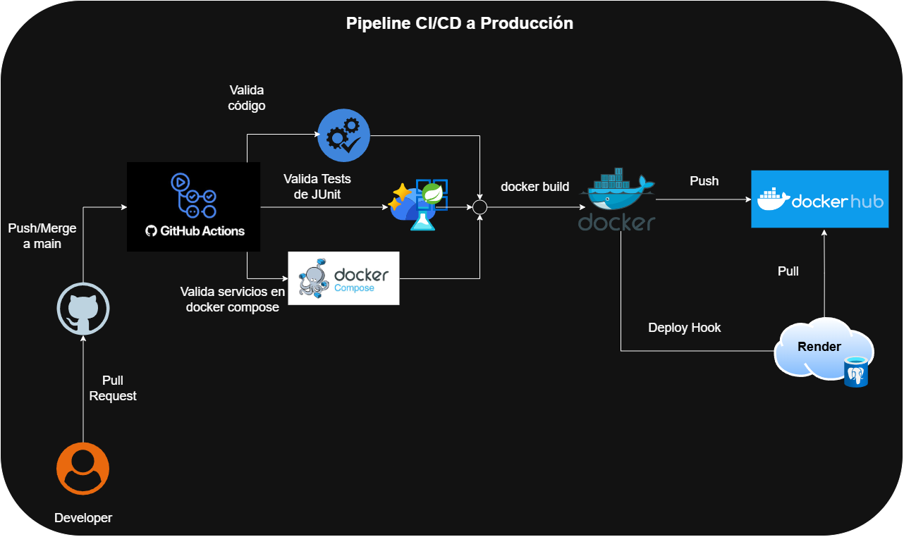

# NL Transport

**NL Transport** es una aplicación web creada para la gestión y administración de clientes y cargas. La plataforma permite realizar un seguimiento detallado del estatus de los envíos y visualizar la ubicación actual de las cargas mediante un mapa interactivo.

---

## 🚀 Tecnologías Utilizadas

- **Backend:** Java 25, Spring Boot, Maven
- **Base de Datos:** PostgreSQL 17
- **Frontend & Mapas:** HTML5, CSS3, JavaScript, Leaflet.js, OpenStreetMap
- **Contenedorización:** Docker, Docker Compose (Multi-stage build con usuario sin privilegios y sistema de archivos de solo lectura)
- **Pruebas:** JUnit 5

---

## 🛠️ Requisitos Previos

- [Docker](https://www.docker.com/) y [Docker Compose](https://docs.docker.com/compose/)
- *(Opcional para desarrollo local sin Docker)* JDK 25 y Maven

---

## 💻 Despliegue Local

1. **Clonar el repositorio y levantar los servicios:**
   Desde la raíz del proyecto, ejecuta el siguiente comando para compilar e iniciar los contenedores de la aplicación y PostgreSQL 17:

   ```powershell
   docker compose --file compose.yml up --build -d
   ```

2. **Acceso a la aplicación:**
   Abre tu navegador e ingresa a [http://localhost:8080](http://localhost:8080). La aplicación creará automáticamente la estructura de tablas y cargará datos de prueba iniciales si la base de datos se encuentra vacía.

3. **Variables de Entorno y Configuración de Puertos:**
   - En entorno local se usan credenciales predeterminadas. Si necesitas modificarlas, copia el archivo `.env.example` a `.env` y asigna tus propios valores.
   - Si los puertos por defecto (`8080` para la app o `5432` para PostgreSQL) están ocupados, define variables en `.env`:
     ```env
     APP_PUBLISHED_PORT=8081
     POSTGRES_PUBLISHED_PORT=5433
     ```

4. **Comandos Útiles:**
   - **Ver logs en tiempo real:** `docker compose --file compose.yml logs -f app`
   - **Detener los servicios (manteniendo datos):** `docker compose --file compose.yml down`
   - **Detener los servicios y eliminar la BD (volúmenes):** `docker compose --file compose.yml down -v`

---

## ⚙️ CI/CD con GitHub Actions y Render

El workflow [`CI a Producción`](.github/workflows/ci_cd.yml) se ejecuta en cada push a `main`. Cada ejecución se identifica como **CI a Producción - @github.actor** y realiza el proceso completo:



1. Compila el código Java.
2. Ejecuta los tests.
3. Valida la configuración de Docker Compose, descarga la imagen de PostgreSQL 17 y construye la imagen de la aplicación.
4. Si las validaciones pasan, publica `adjgc/nl_transport:latest` y una etiqueta inmutable con el SHA del commit en Docker Hub.
5. Solicita a Render desplegar la imagen `latest` mediante el Deploy Hook del Web Service. Configura ese servicio para usar `docker.io/adjgc/nl_transport:latest`; si la imagen es privada, Render también necesita credenciales de lectura de Docker Hub.
6. Publica el resultado de cada job en el resumen y marca el workflow como fallido si una validación, publicación o solicitud de despliegue falla.

Configura estos secretos en **Settings > Secrets and variables > Actions** del repositorio:

| Secreto | Contenido |
| --- | --- |
| `DOCKERHUB_USERNAME` | Usuario de Docker Hub con permiso de escritura en `adjgc/nl_transport` |
| `DOCKERHUB_TOKEN` | PAT de Docker Hub con permiso de lectura y escritura |
| `RENDER_DEPLOY_HOOK` | URL del Deploy Hook del Web Service de Render |

### Configuración inicial de los servicios en Render

1. Crea un servicio **PostgreSQL 17** en Render y espera hasta que esté activo. Entonces podrás consultar el hostname interno, el usuario, el nombre de la base de datos y la contraseña generada por Render.
2. Crea un **Web Service** de tipo **Existing Image** con la imagen `docker.io/adjgc/nl_transport:latest`. Si el repositorio de Docker Hub es privado, agrega credenciales con permiso de lectura para que Render pueda descargarla.
3. En las variables de entorno del Web Service configura:

   | Variable | Valor |
   | --- | --- |
   | `SPRING_DATASOURCE_PASSWORD` | Contraseña generada por Render para el servicio PostgreSQL |
   | `SPRING_DATASOURCE_URL` | URL JDBC construida con el hostname interno, puerto y nombre de base de datos de Render |
   | `SPRING_DATASOURCE_USERNAME` | Usuario definido para la base de datos |

   El formato de `SPRING_DATASOURCE_URL` es `jdbc:postgresql://HOST_INTERNO:PUERTO/NOMBRE_BASE`. Usa el hostname interno de Render y el puerto que muestra el servicio PostgreSQL; no pegues directamente una URI `postgres://` o `postgresql://`, porque Spring Boot espera una URL JDBC.
4. En la configuración del Web Service crea un **Deploy Hook** y guarda su URL como el secreto `RENDER_DEPLOY_HOOK` del repositorio GitHub. Con esto, después de publicar correctamente la imagen, GitHub Actions solicita el despliegue de la versión actualizada.

Render ejecuta la aplicación como Web Service y PostgreSQL como un servicio administrado independiente; `compose.yml` se usa para desarrollo local y validación en CI. Spring Boot utiliza el puerto `PORT` proporcionado por Render y crea o actualiza el esquema al iniciar.

---

Desarrollado con 🤍 por [ADJGC](https://www.linkedin.com/in/adjgc)
